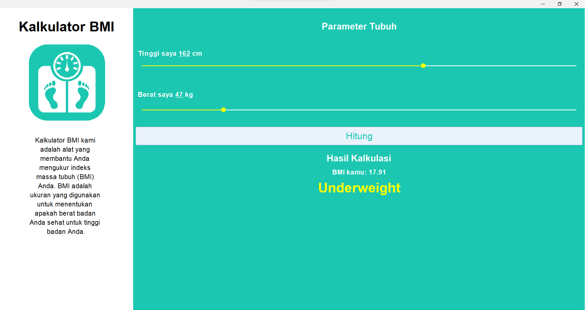

# Proyek Indeks Massa Tubuh (BMI)

Proyek ini adalah aplikasi yang menghitung Indeks Massa Tubuh (BMI) seseorang berdasarkan berat dan tinggi badan mereka.

## Cara Menggunakan

1. Buka aplikasi.
2. Masukkan berat badan Anda dalam kilogram.
3. Masukkan tinggi badan Anda dalam centimeter.
4. Klik tombol 'Hitung'.
5. Hasil perhitungan BMI Anda akan ditampilkan.

## Fitur

- Menghitung BMI berdasarkan berat dan tinggi badan.
- Menampilkan kategori BMI (Underweight, Normal, Overweight, Obese).

## Persyaratan Sistem

- Windows 7 atau lebih baru.
- .NET Framework 4.5 atau lebih baru.

## Pengembangan

Jika Anda ingin berkontribusi pada proyek ini, silakan fork repositori ini dan buat pull request Anda.
